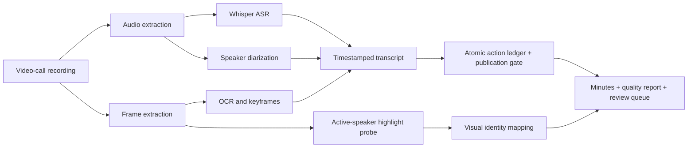

# Meeting Minutes Pipeline

Local-first pipeline for turning flattened video-call recordings into evidence-backed meeting minutes.

The project is designed for cases where the only input is a screen recording, not a Zoom/Meet/Teams export. It combines local ASR, speaker diarization, OCR, keyframe extraction, visual active-speaker evidence, and review queues.

## Why This Exists

Many meeting-minutes tools assume access to platform metadata, participant logs, or cloud transcription. A plain `.mov` screen recording has none of that. This pipeline keeps every artifact on the local machine and treats identity as evidence-sensitive:

- voice clusters separate voices but do not know real names,
- real names require voice enrollment, a reviewed participant map, or visual evidence,
- each decision/action should link back to timestamps and frames,
- low-confidence or mixed-cluster segments stay in review instead of being over-attributed.

## Compared With Existing Projects

A quick GitHub search found related projects such as Whisper + diarization pipelines and Whisper-based meeting-minute generators. This project focuses on a narrower but harder workflow:

- input is a flattened video-call recording,
- screenshots and OCR are first-class evidence,
- active-speaker tile highlights can map names segment by segment,
- output includes `quality_report.md` and `review_queue.md`,
- the default posture is local-first and privacy-preserving.

See [docs/github-search-notes.md](docs/github-search-notes.md) for the search notes.
See [docs/open-source-design-review.md](docs/open-source-design-review.md) for design ideas adopted from related projects.

## Engineering Project Contract

The repository now treats product scope, evidence boundaries, and verification as first-class project artifacts:

- [docs/product-requirements.zh.md](docs/product-requirements.zh.md): product contract captured in Chinese from the original local-meeting workflow.
- [docs/architecture.md](docs/architecture.md): pipeline architecture, trust boundaries, artifact contracts, and platform support.
- [docs/adr/0001-local-first-evidence-pipeline.md](docs/adr/0001-local-first-evidence-pipeline.md): decision record for the local-first evidence pipeline.
- [docs/acceptance-matrix.md](docs/acceptance-matrix.md): acceptance items mapped to automated tests and manual evidence.
- [docs/project-plan.md](docs/project-plan.md): canonical implementation plan and backlog.
- [docs/roster-avatar-identity.md](docs/roster-avatar-identity.md): calibrated same-frame side-roster avatar evidence for Discord Huddles and similar UIs.
- [CONTRIBUTING.md](CONTRIBUTING.md): development workflow, privacy gate, and verification rules.

## Pipeline



## Install

The full runtime targets local Apple Silicon because the default ASR path uses `mlx-whisper` and `mlx`.
Linux CI intentionally runs only the lightweight unit-test subset documented below.

```bash
uv sync
```

Check the local runtime before processing a long recording:

```bash
uv run meeting-minutes doctor
```

An example local Apple Silicon profile is available at `examples/pipeline_profile.apple_silicon.json`.

Optional pyannote support:

```bash
uv sync --extra diarization
export HF_TOKEN="..."
```

Without `HF_TOKEN`, the strongest no-token local backend is SpeechBrain ECAPA clustering.

## Run

```bash
uv run meeting-minutes run \
  --input "/path/to/meeting-recording.mov" \
  --output-dir "/path/to/output/meeting_run" \
  --expected-speakers 4 \
  --diarization-backend speechbrain-cluster \
  --summary-engine extractive
```

Fast proof slice:

```bash
uv run meeting-minutes run \
  --input "/path/to/meeting-recording.mov" \
  --output-dir "/path/to/output/sample_5m" \
  --start 0 \
  --duration 300 \
  --expected-speakers 4 \
  --diarization-backend speechbrain-cluster
```

## Optional DeepSeek Review

`--summary-engine deepseek` is an explicit remote-processing opt-in. It keeps `minutes.md` and the deterministic `action_items.json` unchanged, then writes a separately reviewable `minutes.deepseek.review.md` and `minutes.deepseek.review.json`.

```bash
uv run meeting-minutes summarize \
  --output-dir "$HOME/Documents/meeting-output" \
  --summary-engine deepseek \
  --deepseek-model deepseek-v4-pro \
  --deepseek-env-file .env \
  --deepseek-output-language zh-CN
```

The command reads the variable named by `--deepseek-api-key-env` from the process environment first, then from `--deepseek-env-file` when supplied, otherwise only from `.env` in the invocation directory, and finally from an explicitly configured Keychain service. It never searches parent directories for credentials. The key is never stored in generated artifacts, status files, or logs.

Only transcript `segment_id` and text, plus generic keyframe selection reasons (`opening_frame`, `keyword_nearby`, `scene_change`), leave the machine. Timestamps, recording files, frame images, OCR, frame paths, diarization labels, and identity mappings are not sent. Spoken names can still appear inside transcript text, so obtain the participants' consent before opting in. Use repeated `--deepseek-redact-name` arguments for every known participant name, alias, and non-participant name that must not appear in model-written draft text. Local source quotes remain exact evidence and can retain their original names, so the draft is never a shareable redacted record. The filter normalizes zero-width format characters and strips an explicit set of invisible Unicode code points, including variation selectors, before name matching, but visually confusable spelling variants remain a residual human-review risk.

The configured remote endpoint must use HTTPS. Redirects are blocked before a request can follow them. A loopback endpoint still requires a credential unless `--deepseek-allow-unauthenticated-loopback` is explicitly selected; that opt-in is only suitable for a trusted local process because it receives transcript text.

DeepSeek output is always marked as an external AI review draft. Every item and evidence entry must match an exact local schema: item fields are only `text` and `evidence`, and evidence fields are only `segment_id`. The client derives quotes and timestamps locally from those exact IDs, then rejects unknown or duplicate IDs, identity fields, participant names, owners, action wording, durations, deadlines, links, and model-authored timestamps. Overview and discussion cannot make an agreement or decision assertion. A decision needs exactly one cited segment that itself contains an explicit collective agreement or decision; a confirmed fact, conditional, question anywhere in the cited segment, plan, or proposal does not qualify. The client checks IDs and permitted text forms, not full semantic entailment, so a valid citation does not prove every paraphrase and does not turn the draft into a shareable final record.

The default review language is Simplified Chinese. Use `--deepseek-output-language en` only when an English review draft is required. Every DeepSeek rerun first moves any prior active review to collision-safe `minutes.deepseek.review.stale.json` and `minutes.deepseek.review.stale.md` names. New JSON and Markdown drafts are prepared before publication; an interrupted or failed rerun therefore leaves no prior draft at the active review paths.

Rerun diarization only:

```bash
uv run meeting-minutes diarize \
  --output-dir "/path/to/output/meeting_run" \
  --expected-speakers 4 \
  --diarization-backend speechbrain-cluster
```

## Outputs

- `minutes.md`: meeting minutes with timestamp evidence.
- `transcript.json` and `transcript.md`: timestamped transcript with speaker/name confidence.
- `speaker_turns.json`: diarized voice turns.
- `keyframes/` and `keyframes.json`: selected visual evidence.
- `ocr.json`: OCR text from sampled frames.
- `quality_report.md`: ASR/OCR/diarization/identity status and limits.
- `review_queue.md`: low-confidence speaker/name segments requiring human review.
- `speaker_samples.md`: high-confidence voice-cluster samples for manual review.
- `action_items.json` and `action_items.md`: source-grounded action ledger. Every publishable row has a stable source ID, exact source quote, explicit owner, bounded same-topic evidence, and a fingerprint of the transcript revision that produced it.

## Action Item Gate

Action items are not written directly from keyword matches or free-form model output. The pipeline builds an atomic ledger first, then renders only rows that pass deterministic checks:

- the owner is the speaker making an explicit commitment, or is named in the same assignment sentence,
- the quote and the published action text are the exact source commitment; free-form summaries and translations are review-only,
- an evidence window contains at most eight transcript segments and 45 seconds of bounded context, but properties are inherited only from a segment that explicitly names the identical topic,
- durations are normalized for common English and Chinese hour/minute forms; an unparseable duration phrase rejects publication instead of being ignored,
- a curated row must explicitly state its source topic, and validation regenerates the ledger from `transcript.json` so stale or hand-edited ledger files are rejected,
- only an explicitly named downtime fact can constrain publication; subjectless follow-ups stay in human review,
- contradicting explicit downtime constraints reject a proposed row rather than selecting the latest assertion,
- ambiguous candidates remain in `review_queue.md`; they are never silently discarded or published.

The ledger also runs an independent, high-recall scan over high-confidence named speech for lower-certainty phrases such as `I would like to create` and `I want to create`. This scan is intentionally broader than the automatic candidate matcher. A matched phrase remains review-only; it never becomes an action row automatically. When the scan finds one or more signals, `publish-minutes` requires a fingerprinted internal `--action-intent-review` manifest that records one of two outcomes for every signal: `published`, linked to a reviewed action row owned by the same named participant, or `rejected`, with a constrained rejection reason and review note. This requirement applies even when the shareable Action Items table is empty.

Rebuild the ledger after reviewing an existing run:

```bash
uv run meeting-minutes audit-actions \
  --output-dir "/path/to/output/meeting_run"
```

Validate proposed action rows before sharing a curated minutes document:

```bash
uv run meeting-minutes validate-actions \
  --output-dir "/path/to/output/meeting_run" \
  --items "/path/to/proposed-action-items.json"
```

`proposed-action-items.json` is either a JSON array or an object containing `items`. Each item requires `candidate_id`, `owner`, `source_quote`, and `text`; `text` must equal the source quote after normalisation. A failed command writes `action_items.validation.json` with deterministic rejection reasons and exits non-zero. A human-written rewrite or translation is intentionally not an automatically publishable action item. `minutes.ollama.draft.md` is visibly marked as a non-shareable draft and cannot replace canonical `minutes.md`.

For formal publication, place `minutes.reviewed.action-intents.json` beside the reviewed Chinese and English minutes whenever `action_items.json` contains `intent_recall.signals`, then pass it through `--action-intent-review`. The file is internal evidence, bound to the transcript and action-ledger fingerprints, and is never copied into `share/`.

## Identity Policy

The pipeline never guesses a real name from a voice cluster alone.

Real names can come from:

- explicit voice enrollment ranges,
- a reviewed participant map,
- or calibrated visual evidence such as active-speaker highlights and visible name plates.

If a cluster is mixed or lacks evidence, it stays as `Speaker N` or enters `review_queue.md`.

## Voice Enrollment

Create a template:

```bash
uv run meeting-minutes voice-template \
  --output-dir "/path/to/output/meeting_run" \
  --names Alice Bob Carol Dave
```

Fill clear non-overlapping ranges:

```json
{
  "enrollment_audio_reference": "effective_clip",
  "speakers": {
    "Alice": [{"start": 64.0, "end": 70.0}],
    "Bob": [{"start": 78.0, "end": 86.0}]
  }
}
```

Then run:

```bash
uv run meeting-minutes diarize \
  --output-dir "/path/to/output/meeting_run" \
  --enrollment "/path/to/output/meeting_run/voice_enrollment.template.json" \
  --similarity-threshold 0.4 \
  --similarity-margin 0.06
```

## Visual Identity

`visual-identify` is the production path for video-call UIs that show an active-speaker border. It samples one to three frames per ASR segment, applies a time-bounded layout profile, runs Apple Vision only on nameplate crops, and writes a name only when the active-frame evidence agrees.

The included Proton Meet side-rail profile contains geometry only. Copy it into a local output directory, add the known participant names to its `participants` array, and adjust layout windows after reviewing the generated calibration report.

```bash
cp examples/proton_meet_side_rail_5_slots.json "$HOME/Documents/meeting-output/visual-profile.json"
uv run meeting-minutes visual-identify \
  --output-dir "$HOME/Documents/meeting-output" \
  --visual-profile "$HOME/Documents/meeting-output/visual-profile.json"
```

To apply visual evidence during a new run, add `--visual-profile "$HOME/Documents/meeting-output/visual-profile.json"` to `meeting-minutes run`.

The command writes `visual_identity.json`, `visual_identity_report.md`, nameplate OCR evidence, and referenced frames. An OCR result without a participant whitelist remains a candidate, not a real name. See [docs/visual-identity.md](docs/visual-identity.md) for the profile contract and review rules.

### Side-Roster Avatar Identity

`roster-avatar-identify` is a separate, calibrated evidence path for interfaces such as Discord Huddles where the active tile has no readable nameplate but the same frame exposes a named participant roster. It matches the active tile avatar against roster avatars visible in that exact frame. It is intentionally isolated from the direct-nameplate and same-session voiceprint paths.

The profile must define a participant whitelist, a time-bounded roster region, three manually reviewed and distinct anchor identities, and avatar geometry. The command opens its gate only when all anchors are recovered correctly. By default it can name only identities represented by accepted anchors. It rejects default or indistinguishable avatars, camera or screen-share tiles, zero or multiple active highlights, insufficient roster names, and ambiguous matches. Calibrated same-frame roster evidence may correct weaker cluster or same-session voiceprint labels, but it never overrides a direct nameplate, human confirmation, or enrolled voice identity. Later visual, template, and voiceprint passes preserve the roster identity unless they have a stronger direct active-speaker nameplate consensus. If a recalibration fails while roster identities are already active, it writes attempt-only artifacts and preserves the active transcript, roster evidence, and published minutes. See [docs/roster-avatar-identity.md](docs/roster-avatar-identity.md) for the full contract.

```bash
uv run meeting-minutes roster-avatar-identify \
  --output-dir "$HOME/Documents/meeting-output" \
  --roster-avatar-profile "$HOME/Documents/meeting-output/roster-avatar-profile.json"
```

## Privacy

Do not commit recordings, transcripts from private meetings, screenshots, OCR outputs, or generated minutes. The included `.gitignore` excludes common generated artifacts and caches. See [docs/privacy.md](docs/privacy.md).

## Test

Cross-platform lightweight unit tests, matching the GitHub workflow:

```bash
make test-light
```

Full local tests on the project environment:

```bash
make test
```

Lint and runtime checks:

```bash
make lint
make doctor
```

## Roadmap

Current sequencing is tracked in [docs/project-plan.md](docs/project-plan.md). The older [docs/roadmap.md](docs/roadmap.md) is retained as a technical backlog and points back to the canonical plan.

## License

MIT. See [LICENSE](LICENSE).
