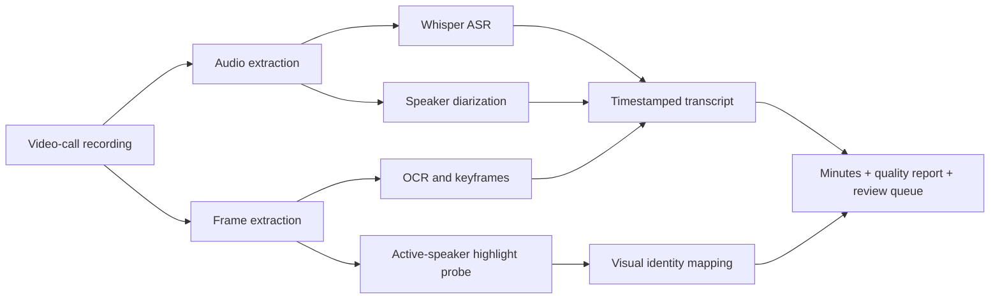

# Meeting Minutes Pipeline

Local-first pipeline for turning flattened video-call recordings into evidence-backed meeting minutes.

The project is designed for cases where the only input is a screen recording, not a Zoom/Meet/Teams export. It combines local ASR, speaker diarization, OCR, keyframe extraction, visual active-speaker evidence, and review queues.

## Why This Exists

Many meeting-minutes tools assume access to platform metadata, participant logs, or cloud transcription. A plain `.mov` screen recording has none of that. This pipeline keeps every artifact on the local machine and treats identity as evidence-sensitive:

- voice clusters separate voices but do not know real names,
- real names require voice enrollment, a reviewed participant map, or visual evidence,
- each decision/action should link back to timestamps and frames,
- low-confidence or mixed-cluster segments stay in review instead of being over-attributed.

## Compared With Existing Projects

A quick GitHub search found related projects such as Whisper + diarization pipelines and Whisper-based meeting-minute generators. This project focuses on a narrower but harder workflow:

- input is a flattened video-call recording,
- screenshots and OCR are first-class evidence,
- active-speaker tile highlights can map names segment by segment,
- output includes `quality_report.md` and `review_queue.md`,
- the default posture is local-first and privacy-preserving.

See [docs/github-search-notes.md](docs/github-search-notes.md) for the search notes.
See [docs/open-source-design-review.md](docs/open-source-design-review.md) for design ideas adopted from related projects.

## Pipeline



## Install

```bash
uv sync
```

Check the local runtime before processing a long recording:

```bash
uv run meeting-minutes doctor
```

An example local Apple Silicon profile is available at `examples/pipeline_profile.apple_silicon.json`.

Optional pyannote support:

```bash
uv sync --extra diarization
export HF_TOKEN="..."
```

Without `HF_TOKEN`, the strongest no-token local backend is SpeechBrain ECAPA clustering.

## Run

```bash
uv run meeting-minutes run \
  --input "/path/to/meeting-recording.mov" \
  --output-dir "/path/to/output/meeting_run" \
  --expected-speakers 4 \
  --diarization-backend speechbrain-cluster \
  --summary-engine extractive
```

Fast proof slice:

```bash
uv run meeting-minutes run \
  --input "/path/to/meeting-recording.mov" \
  --output-dir "/path/to/output/sample_5m" \
  --start 0 \
  --duration 300 \
  --expected-speakers 4 \
  --diarization-backend speechbrain-cluster
```

Rerun diarization only:

```bash
uv run meeting-minutes diarize \
  --output-dir "/path/to/output/meeting_run" \
  --expected-speakers 4 \
  --diarization-backend speechbrain-cluster
```

## Outputs

- `minutes.md`: meeting minutes with timestamp evidence.
- `transcript.json` and `transcript.md`: timestamped transcript with speaker/name confidence.
- `speaker_turns.json`: diarized voice turns.
- `keyframes/` and `keyframes.json`: selected visual evidence.
- `ocr.json`: OCR text from sampled frames.
- `quality_report.md`: ASR/OCR/diarization/identity status and limits.
- `review_queue.md`: low-confidence speaker/name segments requiring human review.
- `speaker_samples.md`: high-confidence voice-cluster samples for manual review.

## Identity Policy

The pipeline never guesses a real name from a voice cluster alone.

Real names can come from:

- explicit voice enrollment ranges,
- a reviewed participant map,
- or calibrated visual evidence such as active-speaker highlights and visible name plates.

If a cluster is mixed or lacks evidence, it stays as `Speaker N` or enters `review_queue.md`.

## Voice Enrollment

Create a template:

```bash
uv run meeting-minutes voice-template \
  --output-dir "/path/to/output/meeting_run" \
  --names Alice Bob Carol Dave
```

Fill clear non-overlapping ranges:

```json
{
  "enrollment_audio_reference": "effective_clip",
  "speakers": {
    "Alice": [{"start": 64.0, "end": 70.0}],
    "Bob": [{"start": 78.0, "end": 86.0}]
  }
}
```

Then run:

```bash
uv run meeting-minutes diarize \
  --output-dir "/path/to/output/meeting_run" \
  --enrollment "/path/to/output/meeting_run/voice_enrollment.template.json" \
  --similarity-threshold 0.4 \
  --similarity-margin 0.06
```

## Visual Identity Probe

For video-call UIs that highlight the active speaker, generate evidence contact sheets:

```bash
uv run python tools/visual_identity_probe.py \
  --video "/path/to/meeting-recording.mov" \
  --output "/path/to/output/identity_probe" \
  --samples-json examples/visual_samples.json \
  --tiles-json examples/proton_meet_tiles.json
```

Apply reviewed visual identity evidence:

```bash
uv run python tools/apply_visual_identity.py \
  --output-dir "/path/to/output/meeting_run" \
  --scores "/path/to/output/identity_probe/highlight_scores.json" \
  --ui-map examples/ui_name_map.json \
  --cluster-fallback examples/cluster_fallback.json \
  --mixed-clusters "Speaker 3"
```

The current helper expects a precomputed `highlight_scores.json`; see [docs/visual-identity.md](docs/visual-identity.md) for the calibration workflow.

## Privacy

Do not commit recordings, transcripts from private meetings, screenshots, OCR outputs, or generated minutes. The included `.gitignore` excludes common generated artifacts and caches. See [docs/privacy.md](docs/privacy.md).

## Test

```bash
uv run --with pytest pytest -q
```

## Roadmap

The next high-value improvements are tracked in [docs/roadmap.md](docs/roadmap.md): VAD/forced alignment, preprocessing profiles, stereo/channel-aware diarization, structured output exporters, and benchmark fixtures.
