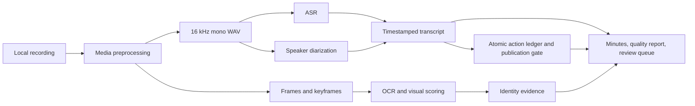

# Architecture

## Scope

Meeting Minutes Pipeline converts a flattened video-call recording into evidence-backed meeting artifacts. The system assumes there is no platform metadata and treats identity as a claim that must be supported by explicit evidence.

## Data Flow

## Components

| Component | Code | Responsibility |
| --- | --- | --- |
| CLI | `meeting_minutes/cli.py` | User entry points, pipeline orchestration, command arguments. |
| Media | `meeting_minutes/media.py` | ffmpeg probing, audio extraction, frame extraction, OCR shell boundary. |
| ASR | `meeting_minutes/asr.py` | `mlx-whisper` invocation and transcript segment normalization. |
| Diarization | `meeting_minutes/diarization.py` | SpeechBrain, pyannote, voice enrollment, speaker attachment. |
| Identity | `meeting_minutes/identity.py` | Participant maps, OCR candidates, evidence-preserving name attachment. |
| Visual identity | `meeting_minutes/visual_identity.py`, `meeting_minutes/visual_highlight.py`, and `meeting_minutes/cli.py` | Time-bounded layout profiles, active-speaker border scoring, cropped nameplate OCR, segment-level identity assignment, and calibration evidence. |
| Action guard | `meeting_minutes/action_items.py` | Atomic commitment extraction, stable source IDs, topic and attribute normalization, constraint facts, and deterministic publication validation. |
| Reporting | `meeting_minutes/report.py` | Markdown transcript, minutes, quality report, review queue, speaker samples. |
| Summarization | `meeting_minutes/summarizer.py`, `meeting_minutes/deepseek.py` | Optional local or explicit remote LLM review drafts. Neither is an identity source or action-item publisher. DeepSeek accepts only `text` plus exact segment IDs, fingerprints exactly those transmitted records, derives quotes and times locally, blocks redirects, and never changes canonical minutes. |

## Artifact Contract

| Artifact | Producer | Required fields or purpose |
| --- | --- | --- |
| `transcript.json` | CLI | ASR segments with `start`, `end`, `text`, `speaker`, `speaker_confidence`, optional `name`, optional `frame_refs`. |
| `speaker_turns.json` | Diarization | Speaker turns with `start`, `end`, `speaker`, backend status, confidence when available. |
| `keyframes.json` | Keyframe selection | Frame path, timestamp, selection reasons. |
| `ocr.json` | OCR stage | Frame path, timestamp, recognized text records. |
| `visual_identity.json` | Visual identity command | Profile settings, slot-name resolution, per-frame highlight scores, and segment assignment summary. |
| `visual_identity_report.md` | Visual identity command | Human-readable calibration evidence, resolved slots, assignment counts, and explicit limits. |
| `action_items.json` | Action guard | Transcript fingerprint, candidates, exact quotes, bounded evidence, source-topic-bound normalized attributes, and contradiction constraints. |
| `action_items.md` | Action guard | Human-readable publishable and review-required action ledger. |
| `minutes.md` | Reporting | Evidence-backed summary candidates, timestamp links, and action rows rendered only from the action ledger. |
| `minutes.deepseek.review.json` | Optional DeepSeek review | Draft-only validated claims, local citation results, input fingerprint, and no credential or raw API response. |
| `minutes.deepseek.review.md` | Optional DeepSeek review | Human-readable external AI review draft with local source citations; never canonical or directly shareable. |
| `minutes.deepseek.review.stale.json` and `minutes.deepseek.review.stale.md` | DeepSeek rerun predecessor | Collision-safe archive of a previously active external review, retained for traceability but never current. |
| `quality_report.md` | Reporting | Pipeline status, mapped-name counts, unresolved counts, known limits. |
| `review_queue.md` | Reporting | Segments that need human review before identity or summary claims are trusted. |

## Action Publication Boundary

The action guard is a fail-closed publication boundary:

1. A candidate starts from one explicit commitment sentence with one named topic and an explicit owner.
2. Context may explain the conversation, but it cannot donate a duration or downtime fact unless that context segment explicitly names the identical topic.
3. The canonical minutes render the exact commitment quote. Model output is draft material and cannot write canonical action rows.
4. `validate-actions` regenerates the ledger from `transcript.json` and rejects any stale or hand-edited ledger, rewrite, translation, unparsed duration, ungrounded topic or property, or contradictory explicitly named downtime fact.
5. Ambiguous candidates and any human-facing rewrite remain review work rather than silently becoming published claims.

## Identity Trust Model

From strongest to weakest:

1. Voice enrollment from clear non-overlapping known-speaker ranges.
2. Segment-level visual active-speaker evidence with calibrated UI boxes.
3. Reviewed cluster fallback, clearly marked as cluster-level evidence.
4. Human participant map from `Speaker N` to a name.
5. OCR candidate names, retained as candidates unless explicitly allowed.

The pipeline never promotes an anonymous voice cluster to a real name without one of these evidence sources.

## Platform Matrix

| Platform | Expected capability | Verification command |
| --- | --- | --- |
| Apple Silicon macOS | Full local pipeline, including `mlx-whisper` and local diarization. | `make test` and `make doctor` |
| Linux GitHub runner | Lightweight unit tests for pure logic and visual scoring. | `make test-light` |
| Linux GPU | Future backend target. | No committed verification contract yet. |

The GitHub workflow intentionally does not run `uv sync`, because the default project dependencies include Apple Silicon-specific `mlx` wheels.

## Verification Layers

1. Lightweight CI: pure Python behavior, report generation, identity boundaries, visual scoring with synthetic images.
2. Full local tests: project environment on the target Mac.
3. Private media acceptance: manual review of ASR, diarization, visual identity, and evidence-backed minutes on local recordings.
4. Action publication gate: a proposed action row must validate against `action_items.json`; unsupported duration, topic, owner, quote, or downtime claims are rejected before publication.

No public fixture currently proves end-to-end ASR or diarization quality. The acceptance matrix marks those items as manual evidence.
